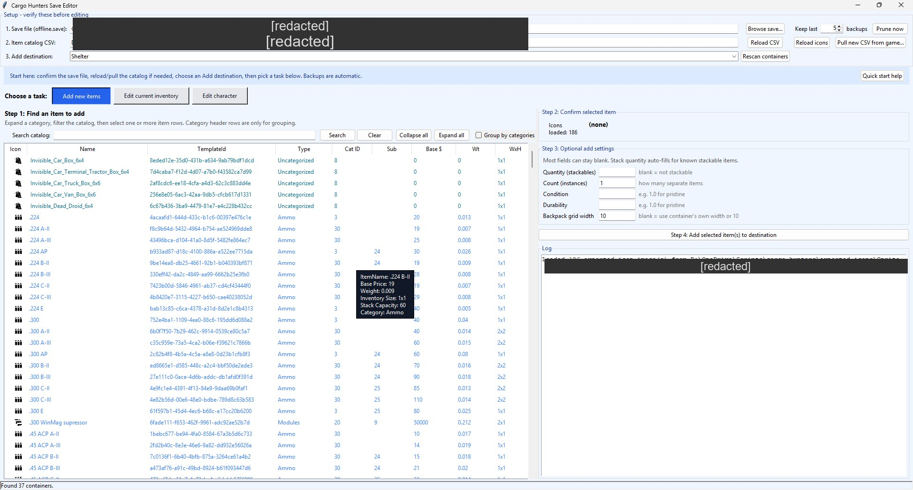
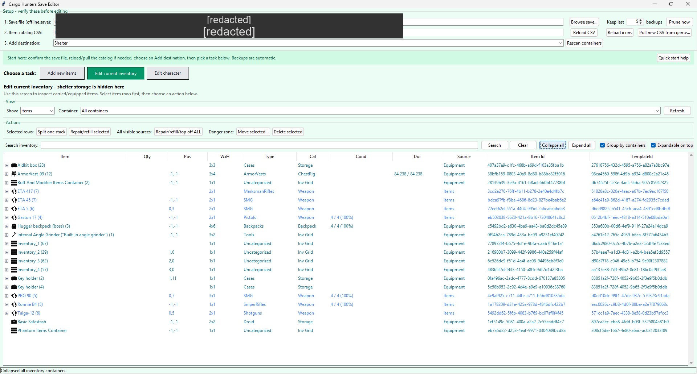
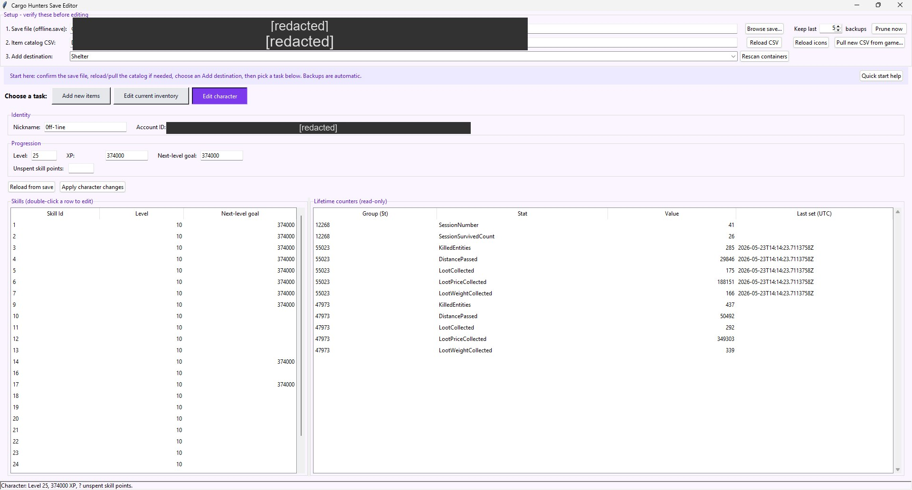

# Cargo Hunters Save Editor

A local Tkinter-based editor for the Cargo Hunters `offline.save` file. The tool can add items from a CSV catalog, inspect current inventory, repair/refill/top off existing items, split stacks, delete items, edit character XP and skill levels, and preview exported UI icons.

## Screenshots

| Add new items | Edit current inventory | Edit character |
| --- | --- | --- |
|  |  |  |

(Personal paths and account identifiers are blanked out in these screenshots; they are not edits the editor itself makes.)

## Quick start (standalone)

1. Close Cargo Hunters before editing your save.
2. Download `CargoHuntersSaveEditor.exe` and double-click it. No Python install, no dependencies.
3. The editor defaults to:
   - `%USERPROFILE%\AppData\LocalLow\OrderOfMeta\Cargo Hunters\offline.save`
4. Pick a destination container.
5. Use either:
   - **Add new items** to add new catalog items.
   - **Edit current inventory** to inspect and modify existing non-shelter items.

The tool creates timestamped backups before writing changes. Settings are saved to `editor_settings.json` next to the exe.

The GUI includes a **Quick start help** button with a short walkthrough. Most controls also have hover tooltips, and Add Items rows show item specs when hovered.

The active workflow is color-coded: **Add Items** uses a faded blue background, while **Current Inventory** uses a faded green background.

## Building from source

Users don't need this — the pre-built `CargoHuntersSaveEditor.exe` is fully self-contained. Only do this if you've modified the source and want to ship a new exe.

```pwsh
pwsh -NoProfile -ExecutionPolicy Bypass -File .\build_exe.ps1 -Clean
```

Output: `dist\CargoHuntersSaveEditor.exe` (one file, ~15 MB, bundles the catalog CSV, the Sprite icons, Python 3.12, and Tk).

To run the source directly during development (requires Python 3.10+):

```pwsh
python editor_gui.py
```

`run.bat` is provided as a convenience for that source workflow.

## Main files

| File/folder | Purpose |
| --- | --- |
| `CargoHuntersSaveEditor.exe` *(in `dist/` after build)* | Standalone Windows executable. No Python required. |
| `build_exe.ps1` | Builds the standalone exe via PyInstaller. |
| `CargoHuntersSaveEditor.spec` | PyInstaller spec controlling bundled data + exe options. |
| `editor_gui.py` | Main Tkinter save editor. |
| `save_io.py` | Save loading/writing, container discovery, repair/refill/top-off, placement, and stack splitting helpers. |
| `add_item.py` | CLI-compatible item insertion backend used by the GUI. |
| `all_items_detailed.csv` | Active item catalog used by the GUI (bundled into the exe). |
| `exported_icons/Sprite/` | Icons bundled into the exe. `Texture2D` images are intentionally ignored. |
| `run.bat` | Optional source-run launcher (development only). |
| `extract_item_catalog_from_game.py` | Refresh the CSV from a Cargo Hunters install (source-only utility; requires UnityPy). |
| `extract_item_icons.py` / `.ps1` | Refresh icons from a Cargo Hunters install (source-only utility). |
| `requirements-icons.txt` | Optional deps for the two extractor utilities. |
| `shop_inventories_from_game.csv` | Extracted shop/offline price list commodity data. |

## Add Items screen

The **Add new items** screen is organized as a four-step workflow: find item(s), confirm the selection, adjust optional add settings, then add them to the selected destination. The item list can be grouped by visual category or shown as a flat sortable list. Category rows can be expanded/collapsed, and the editor remembers category collapse state between filtering, sorting, adding items, refreshes, **and between editor sessions**.

Category headers (e.g. **Ammo**, **Armor**, **Repair Kit**) are tinted to match the color of their items, so the color coding is visible even when the category is collapsed. Any items the editor does not yet recognise are grouped under **Uncategorized** in the default black color so new entries are easy to spot after a game update.

The **3. Add destination** dropdown and the **Step 4: Add selected item(s) to destination** button are highlighted in green to flag the active write target.

Use normal click for one item, or **Ctrl/Shift-click** to select multiple item rows. The add settings apply to every selected item row. For example, if **Count** is `2` and three item rows are selected, the editor adds two instances/stacks of each selected item.

Hover over an Add Items row to see a compact spec card with `ItemName`, base price, weight, inventory size, stack capacity, and category.

Category names are normalized to avoid noisy one-off groups:

- Size variants such as `RepairKitSmall`, `RepairKitMedium`, and `RepairKitLarge` are grouped under `RepairKit`.
- One-off loot paths such as `Loot/CPU` and `Loot/CPUcooler` are grouped under the top-level `Loot` category instead of creating separate tiny categories.

### Add controls

| Control | What it does |
| --- | --- |
| **Search** | Filters the addable catalog. Searches names, template IDs, categories, prices, sizes, and CSV fields. |
| **Collapse categories** | Collapses every Add Items category group and remembers that state. |
| **Expand categories** | Expands every Add Items category group and remembers that state. |
| **Group by categories** | Toggles category grouping. Turn it off to show all matching items in one flat list that sorts globally by any column. |
| **Item table headers** | Click a column header to sort. Sort order is maintained where possible after actions. |
| **Quantity (stackables)** | Quantity placed on each stackable item. Known stackables auto-fill to their max stack. Leave blank for non-stackable items. |
| **Count (instances)** | Number of separate item instances/stacks to add. |
| **Condition** | Optional condition value for newly added items. The repair action uses true full condition value `4.0`. |
| **Durability** | Optional durability/use value for newly added items. |
| **Backpack grid width** | Grid width used by the placement helper. Usually auto-filled from the selected destination container. |
| **Add to inventory** | Adds every selected item row to the selected destination container and writes backups. |

Search/filter matching is case-insensitive and works with whole or partial text anywhere in the searchable fields. Punctuation, separators, and camel-case boundaries are normalized too, so `repairkit`, `repair kit`, and partial fragments can find the same items.

GUID fields such as `ItemID`, `TemplateID`, and save item instance IDs are displayed in the tables but are intentionally not searched by filters.

### Search examples

- `cash`
- `ars`
- `repairkit`
- `repair kit`
- `C-METER` or `CO-METER` — finds the Datameter/`QuestTool_01` row.
- `category=Ammo`
- `category=pair`
- `cat=3`
- `subcategoryid=10`

## Current Inventory screen

The **Edit current inventory** screen shows non-shelter save contents grouped by container. It includes the `inventory` and `equipment` sources, but intentionally hides the `shelter` source. View controls and edit actions are separated to make it clearer which actions apply to selected rows and which actions scan all visible sources. Container collapse state is remembered between refreshes, actions, **and between editor sessions** — the same expand/collapse pattern is restored next time you open the editor.

Action buttons are color-coded so the consequence of each click is obvious at a glance:

- Blue: `Split one stack`, `Repair/refill selected`.
- Green: `Repair/refill/top off ALL`.
- Red (Danger zone): `Move selected…`, `Delete selected`.

Use **Group by containers** to switch between the normal container-grouped view and a flat sortable list of all visible inventory items.

### Inventory controls

| Control | What it does |
| --- | --- |
| **Container** | Shows all non-shelter inventory/equipment containers or one selected container. |
| **Refresh** | Reloads inventory from the selected save while preserving sort/collapse state. |
| **Collapse all** | Collapses visible inventory containers and remembers that state. |
| **Expand all** | Expands visible inventory containers and remembers that state. |
| **Group by containers** | Toggles container grouping. Turn it off to show all visible inventory rows in one flat sortable list. |
| **Split stack** | Splits one selected stackable item row into two stacks using a slider. |
| **Repair/refill selected** | Sets selected items to 100% condition/durability, refills known uses, and tops off known stack sizes. |
| **Repair/refill/top off ALL** | Scans all non-shelter inventory/equipment items and repairs/refills/tops off everything with known max values. |
| **Move selected…** | Move selected items into a chosen destination container. Children of moved containers travel with them; capacity is validated before the write. |
| **Delete selected** | Deletes selected item rows. Container header rows are ignored. |
| **Filter** | Filters inventory by item name, category, source, quantity, condition, durability, or saved non-ID stats. GUID fields are intentionally not searched. |

### Inventory filter examples

- `ammo`
- `ars`
- `repairkit`
- `category=Ammo`
- `cat=3`
- `source=inventory`

## Repair, refill, and top-off behavior

The editor repairs and refills by editing item `AdditionalData._data` values in the save.

- Full condition is treated as `4.0`.
- Durability is set to the item maximum when a max value is stored.
- Known use-count/health items are refilled to known max values, including MaRS at `1600`.
- Body-part mods that store only `DurabilityComponent_durability` (no `_md` sibling) are now repaired too. The Structure body-part mod (`Mod_Armor_01`) is restored to its catalog cap of `15.0`, and Grinder disk *middle* / *premium* are restored to `10.0` / `5.0` respectively.
- Known stackable items are topped off to `StackCapacity` from `all_items_detailed.csv` or built-in known stack sizes.
- Stackable items missing `StackableComponent_quantity` are displayed as an implicit `1 / max` when a max stack is known; top-off can add the missing quantity field.

## Backups and safety

- Every save-changing action writes a timestamped backup before or during save write.
- Still keep your own manual save backups before large edits.
- Do not edit the save while the game is running.
- If something looks wrong, close the editor and restore the newest known-good backup.

## Icons

The GUI now loads icons only from `exported_icons/Sprite/`. `Texture2D` images and `exported_ui_icons/` are intentionally ignored, so all visible item icons, preview icons, and Add Items category header icons come from Sprite PNGs.

Because Sprite contains mostly category/UI artwork rather than one-off item textures, specific items fall back to the best matching Sprite category icon when no exact Sprite exists. For example, ammo variants use `Icon_Ammo`, weapon groups use `Icon_AR`, `Icon_Pistol`, `Icon_Shotgun`, etc., and resources use the matching `Icon_Resources` subcategory sprites.

Grouped Add Items category headers also use Sprite icons when possible. Visual groups such as `Ammo`, `Pistols`, `Backpacks`, `BodyParts`, `Loot`, `Resources`, and `Tools` map to matching `Icon_*` or `Category_*` sprites from `exported_icons/Sprite/`.

Some catalog rows have explicit icon aliases when the game data does not name an icon directly:

- `12x70` ammo variants fall back to the Sprite ammo icon when no specific Sprite shell icon exists.
- `Body Mods/Arms`, `Body Mods/Legs`, `Body Mods/Heads`, and `Body Mods/Torsos` use matching body-part UI icons.
- `Camo_01`, `Camo_02`, etc. use Sprite category fallbacks because `Paint_Can` is not a Sprite icon.
- Market category rows such as `Ammo`, `Resources/Tools`, and `Weapons/Pistols` use their corresponding Sprite category icons.

Use **Reload icons** after adding or replacing exported icon files.

## Refreshing item data from the game (source-only)

The bundled catalog is good for the development game version. If the game ships an update that adds new items, refresh from source — the **Pull new CSV** button is intentionally hidden in the standalone exe because it shells out to a separate Python tool.

From a source checkout (with Python 3.10+ and `requirements-icons.txt` installed):

```pwsh
python extract_item_catalog_from_game.py --game-dir "D:\Games\Cargo.Hunters.vX.Y.Z" --replace --csv all_items_detailed.csv --install-deps
```

Then rerun `build_exe.ps1` to ship a new standalone exe with the refreshed data.

## Troubleshooting

- If the standalone exe does nothing on first launch, give it a moment — the first run extracts bundled resources to `%TEMP%`. Subsequent launches are faster.
- If a Windows SmartScreen warning appears, click **More info** → **Run anyway**. The exe is unsigned.
- If the save path is empty or invalid, use **Browse…** and select `offline.save` manually.
- If you want to override the bundled CSV with a newer one, place `all_items_detailed.csv` next to the exe and it will be used in preference to the bundled copy.
- If an item cannot be split, it probably does not store `StackableComponent_quantity` in the save or has quantity less than 2.
- For Python-traceback troubleshooting, run from source: `python editor_gui.py` (or `run.bat`).

## Notes

This tool is intentionally local/offline. It edits your local `offline.save` JSON-style save data and does not contact any online service.
